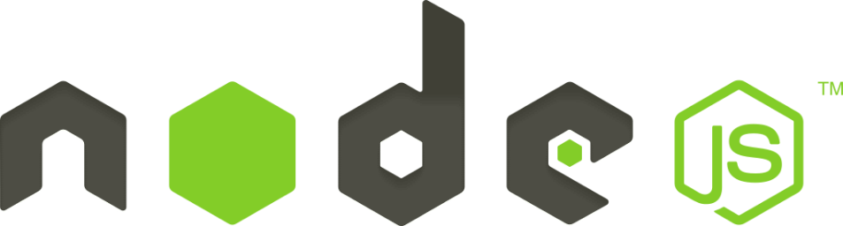

# Siddhant's Portfolio

### This website uses Material UI as the front-end framework in stead of Materialize and MongoDB as the database.

### 

### Get Started

___

```bash
npm install --save
npm run dev
```

